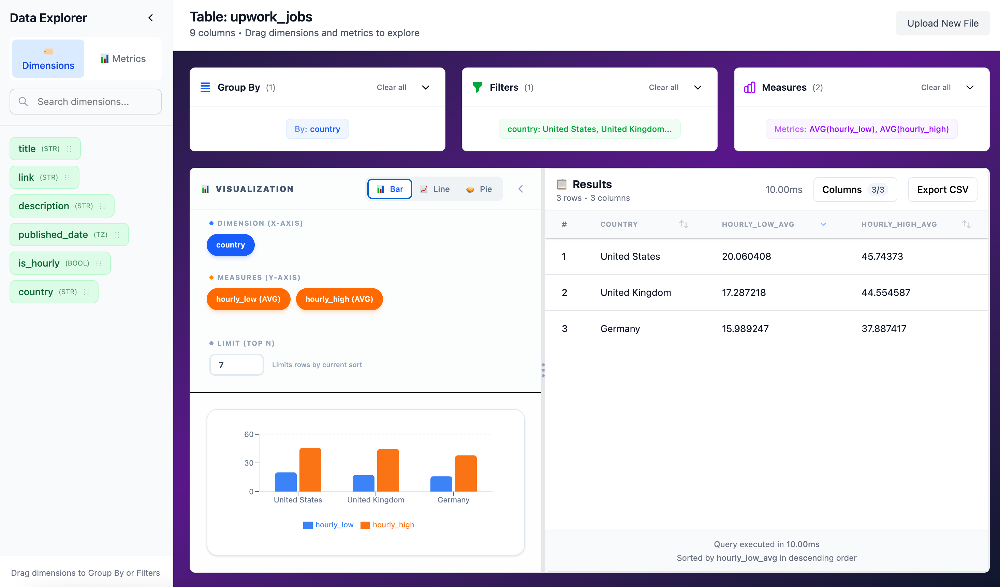

# Data Explorer

A client‑side simplified data explorer built with React and DuckDB WASM. Upload CSV (and eventually Parquet) and query your data in the browser.

**Live demo:** https://slicer-ckzv.vercel.app/

---



## Features

- CSV file upload and parsing
- Client‑side SQL querying using DuckDB WASM
- Drag‑and‑drop query builder (dimensions → Group By/Filters)
- Interactive results table with sorting, paging and formatting
- No backend – all work happens in browser memory

## Status

✅ Core CSV upload + schema inference works

✅ Drag‑drop query builder and results table are functional

🚧 Parquet/GeoJSON support, charts and exports still in progress

⚠️ Can struggle with very large (>10 MB) files due to browser memory

### How to Use

1. **Upload a CSV file** using the file upload area
2. **Browse dimensions and metrics** in the left sidebar
3. **Drag dimensions** to either:
   - **Group By zone**: For aggregating data by specific columns
   - **Filters zone**: For filtering data by specific values
4. **Results update automatically** as you add or remove dimensions

### Drag & Drop Features

#### Source: Sidebar

- **Dimensions Tab**: String/categorical fields (green badges)
- **Metrics Tab**: Numeric fields (blue/purple badges)
- **Search**: Filter columns by name
- **Draggable**: Every column is draggable with visual feedback

#### Target: Group By Zone

- **Visual feedback**: Zone highlights when draggable items are hovering
- **Duplicate prevention**: Cannot add the same column twice
- **Reordering**: Drag chips within the zone to change order
- **Clear all**: Remove all dimensions at once

#### Target: Filters Zone

- **Visual feedback**: Zone highlights when draggable items are hovering
- **Duplicate prevention**: Cannot add the same column twice
- **Value selection**: After dropping, select specific values to filter by
- **Multiple filters**: Add multiple dimension filters

### Technical Implementation

The drag-and-drop functionality uses `@dnd-kit/core` and `@dnd-kit/sortable`:

- **DraggableSidebar**: Columns in sidebar are draggable with proper data attributes
- **Drop Zones**: GroupByZone and FiltersZone handle drop events
- **State Management**: Zustand store (`dragDropStore.ts`) manages drag state
- **Visual Feedback**: DragOverlay shows what's being dragged during operations

## File Structure

### Getting started

```bash
npm install
npm run dev       # start local server
npm run build     # production bundle
npm run lint      # run eslint
npm run test:e2e  # playwrite end‑to‑end tests
```

Local app runs at http://localhost:5173 by default.

## CSV Processing Implementation

The application implements a robust CSV parser that handles:

- **Quoted Values**: Properly processes commas, quotes, and newlines within quoted fields
- **Type Inference**: Automatically detects data types from sample values
- **Schema Creation**: Generates appropriate SQL column types
- **Data Validation**: Validates file format, size, and structure

### Type Inference Logic

```typescript
// Simple type detection
- Empty/null values → VARCHAR
- All numeric values → INTEGER or DOUBLE
- All valid dates → DATE
- Otherwise → VARCHAR
```

## Testing Strategy

### Smoke Test

- **File**: `tests/smoke.spec.ts`
- **Coverage**: Full upload → processing → results flow
- **Timeout**: 30 seconds for file processing

### Test Data

- **Location**: `public/test-data.csv`
- **Content**: 10 rows with mixed data types (name, age, city, department, salary)

**Requirements**: WebAssembly support, ES2020+ JavaScript

## Performance Considerations

- **File Size Limit**: 100MB maximum (configurable)
- **Memory Usage**: All data stored in browser memory
- **Processing Time**: Typically 1-5 seconds for 10,000 row CSV files
- **Bundle Size**: ~500KB main bundle (includes DuckDB WASM)

## Security

- **Client-Side Only**: No data leaves the browser
- **Input Validation**: All files validated before processing
- **SQL Injection Protection**: Query validation and sanitization
- **Content Security Policy**: Recommended for production deployment
